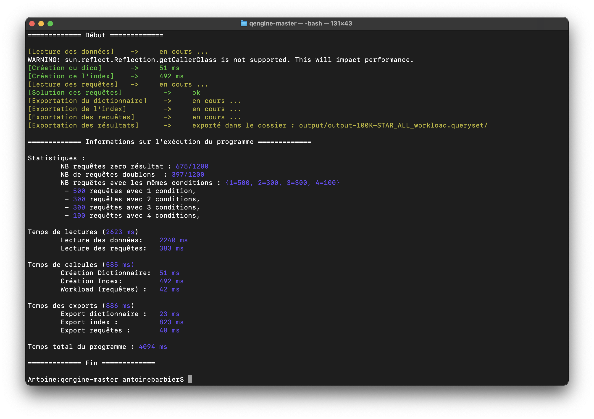

# Implementation d’un mini moteur de requêtes en étoile

Groupe : Antoine Barbier et Djamel Benameur

Git : https://gitlab.com/An_toine/implementation-d-un-mini-moteur-de-requetes-en-etoile/



---

## Passer les options en paramètre
Pour lancer le programme, suivre les étapes suivantes:

Options du programme : 
Soit on utilise l'option seul : ```clean```
L'option clean permet de supprimer le fichier output-historique.csv

Soit on utilise la combinaison des options suivante :

```-queries <queryFile>``` : obligatoire

```-data <dataFile> ``` : obligatoire

```-output <restultFolder>``` : facultative

```-type-output <type>``` : falcultatif, le type est ```txt``` ou ```csv``` (par défault c'est csv)


Par exemple, on peut lancer le programme de la façon suivante :

```qengine -queries <queryFile> -data <dataFile> -output <restultFolder> -type-output <typeFile>```

---

## Exécuter le programme

On peut lancer le programme avec le fichier ```qengine-AntoineBARBIER-DjamelBENAMEUR.jar``` en utilisant la commande suivante :

```
java -jar qengine-AntoineBARBIER-DjamelBENAMEUR.jar [options]
```


On peut aussi lancer le programme à partir du code sources avec un IDE.

+ VsCode : Modifier le fichier ```.vscode/launch.json```, placer les options dans "args" comme dans l'exemple suivant : 
    ```
    "args": "-queries queries/sample_query.queryset -data data/sample_data.nt"
    ```
+ Eclipse : Configurer le RUN, java application > Main, et placer les options dans program arguments. 


